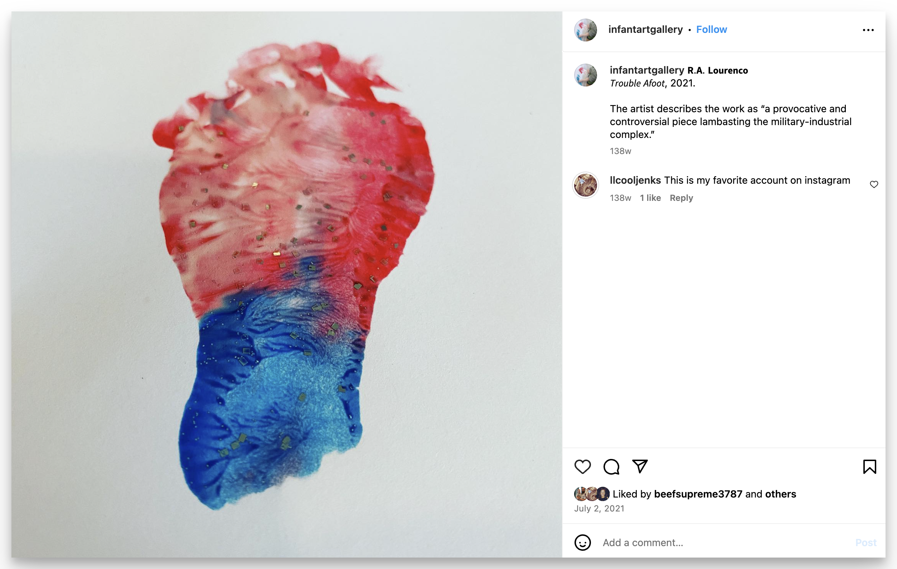
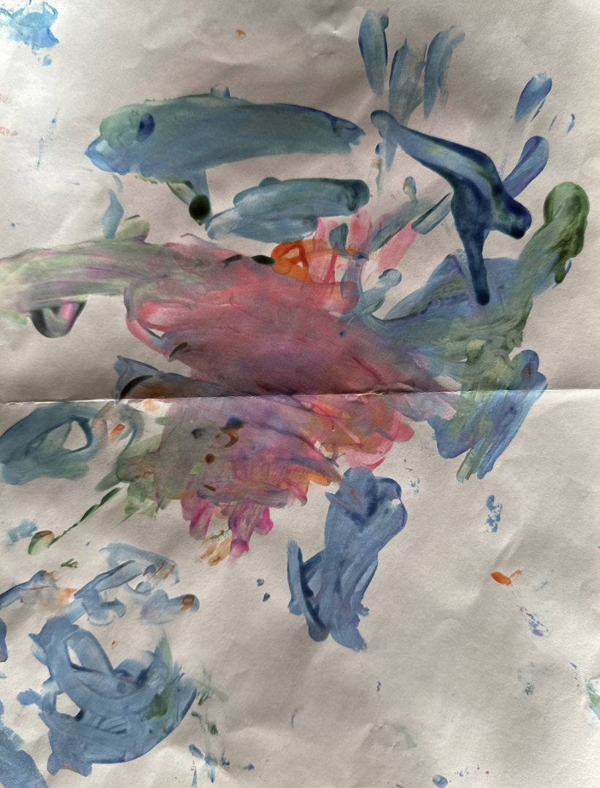

One of the things I was unaware of as a first-time dad is that as soon as your kid is old enough for daycare, you will quickly become inundated with their "art", whether the child has developed motor skills or not.

It starts off with the occasional footprint on construction paper stuffed in a backpack, but before you know it, you'll find yourself with a collection of random squiggles and dots on various paper-based media piling up in your home.

I consider myself a fairly sentimental guy, but I'm not a fan of physical clutter, so what's a guy to do? Digitize it! (And if I'm going to go through the trouble of scanning all these precious scribbles, we might as well have some fun along the way).

Originally I planned on simply snapping an image of the artwork in question and posting to an [Instagram account](https://www.instagram.com/infantartgallery) I created, with my own artsy-fartsy highbrow captions.

This approach worked for about two posts before I quickly decided it wasn't worth the time and effort to craft some pseudo-intellectual art-babble for every piece.

## AI to the Rescue

As it turns out, LLMs are quite good at vomiting prose, so I enlisted ChatGPT to help me out with my project. One of the benefits of using an LLM like ChatGPT is the ability to upload documents along with your prompt to query or extra data from them. I took advantage of this feature and uploaded an image of a drawing. ChatGPT did a surprisingly good job identifying particular characteristics about the image -- shapes, strokes, colors, etc -- and weaved them into the output. Check out the following example.

### Image

### Prompt

"As a humorous exercise, create a highbrow artist statement for this piece of toddler art. Make it funnier by interpreting heavier themes that a toddler would clearly have no knowledge about. Use fancy art speak when possible."

### Result

> Title: "Innocence Adrift in the Chromatic Sea"
>
> This piece presents an unfiltered odyssey into the naive psyche, liberally splashed with a chromatic spectrum that defies the conventional palette. The artist—whose age belies their profound grasp of the human condition—explores the existential dichotomy of joy and chaos, manifesting in an abstract expressionist tour de force.
>
> With each stroke, the notion of a prelapsarian world emerges, where the untamed emotions are as vivid and untainted as the colors themselves. The central motif, a riotous explosion of pink and cerulean, might represent the clash of innocence against the inexorable tide of societal constructs.
>
> It's a commentary on the fragility of youth, an artful juxtaposition of the artist's unburdened beginnings against the complex backdrop of modern existential angst. The toddler's hand, ostensibly playful, channels a raw, uncorrupted vision of our world—a tableau untainted by the cynic's gaze.
>
> In sum, this work is a compelling narrative of formative expressionism, a bold declaration that the most profound insights often come from the minds of the purest among us.

Now we're cooking!

## Automating the Analysis

It's great that we can use the ChatGPT interface to upload our precious artwork and churn out a load of bollocks. Still, it's somewhat tedious to do this for every picture we have. Ideally, we'd like to upload our image(s) to some endpoint, and the artspeak is returned in a JSON formatted response.

Let's see how we can do this with the OpenAI API and an AWS Lambda function.
